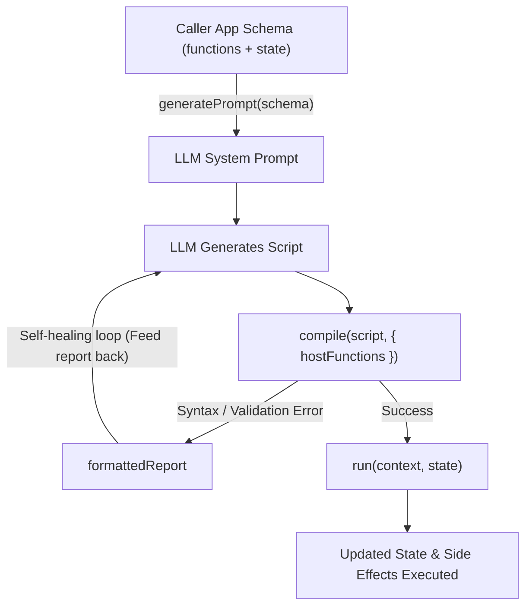

# spelllang — Caller App Integration Guide

A minimalistic, securely sandboxed scripting engine designed for **LLM code generation** and **visual block editors**. 

* **Zero external imports / pure JavaScript (zero runtime dependencies).**
* **Direct host function injection (no artificial `app.` prefix).**
* **Tolerant parser with automatic AST sanitization (Postel's Law).**
* **LLM self-healing diagnostic error reports.**
* **Pure synchronous execution & persistent state (`state.`).**

> **See Also:**
> * [API.md](API.md) — Complete standard library reference, syntax tolerances, and design decisions.
> * [AGENTS.md](AGENTS.md) — Architectural guidelines and prompt rules for AI coding assistants.

---

## 1. The spelllang Workflow



---

## 2. Installation & Module Support

Supports both **ESM (`import`)** and **CommonJS (`require`)**:

```javascript
// ESM
import { compile, run, generatePrompt, formatErrorReport } from 'spelllang';

// CommonJS
const { compile, run, generatePrompt, formatErrorReport } = require('spelllang');
```

---

## 3. Step-by-Step Integration

### Step 1: Define Your Host Environment Schema

Specify the functions and state variables your host application exposes to scripts:

```javascript
const appSchema = {
    title: "IoT Rule Engine Guide",
    functions: [
        {
            name: "getSensors",
            signature: "getSensors(type: Str): List<Map>",
            description: "Returns an array of sensors: { id: Str, value: Num, room: Str }"
        },
        {
            name: "setDeviceState",
            signature: "setDeviceState(id: Str, active: Bool): Bool",
            description: "Switches an appliance on (true) or off (false)"
        },
        {
            name: "notify",
            signature: "notify(message: Str, priority: Num): Bool",
            description: "Dispatches a push notification"
        },
        {
            name: "getTime",
            signature: "getTime(): Num",
            description: "Returns the current UNIX timestamp in seconds"
        }
    ],
    state: {
        is_armed: "Bool (true if the alarm system is active)",
        last_breach_room: "Str (room name where the last motion was detected)",
        last_incident: "Num (UNIX timestamp of the most recent alert)"
    },
    instructions: "Never turn off security sensors. Prioritize notifications for living room incidents."
};
```

---

### Step 2: Generate the LLM System Prompt

Pass the schema to `generatePrompt()` to build a complete, strictly formatted system prompt for your AI model:

```javascript
import { generatePrompt } from 'spelllang';

const systemPrompt = generatePrompt(appSchema);

// Feed `systemPrompt` as the 'system' role message in your LLM request
// (e.g. OpenAI, Anthropic, OpenRouter, Google Gemini, Ollama):
const llmRequest = {
    model: "deepseek-chat",
    messages: [
        { role: "system", content: systemPrompt },
        { role: "user", content: "If any motion sensor is active while armed, alert with priority 3." }
    ]
};
```

---

### Step 3: Execute the Script in Your Application

When the LLM returns the `spelllang` script, execute it synchronously using `run()`:

```javascript
import { run } from 'spelllang';

const script = `
let motion = getSensors('motion') |> filter(fn(s: Map) { s.value > 0 })

if len(motion) > 0 && state.is_armed {
    let breach = motion |> first()
    state.last_breach_room = breach.room
    state.last_incident = getTime()
    notify("Intrusion detected in " + state.last_breach_room, 3)
}
`;

// Provide real implementation of context callbacks and persistent state
const context = {
    getSensors: (type) => [
        { id: 's1', value: 1, room: 'living_room' },
        { id: 's2', value: 0, room: 'kitchen' }
    ],
    setDeviceState: (id, active) => {
        console.log(`Setting ${id} to ${active}`);
        return true;
    },
    notify: (message, priority) => {
        console.log(`[ALERT Level ${priority}] ${message}`);
        return true;
    },
    getTime: () => Math.floor(Date.now() / 1000)
};

const state = {
    is_armed: true,
    last_breach_room: null,
    last_incident: 0
};

// Execute!
const updatedState = run(script, { context, state });

console.log("Updated State:", updatedState);
// Output: { is_armed: true, last_breach_room: 'living_room', last_incident: 1710000000 }
```

---

### Step 4: The Self-Healing Error Loop (Recommended for Production)

If the LLM generates invalid code (e.g. an unsupported syntax operator or shadows a built-in function), use `compile()` to capture a **pre-formatted diagnostic report** to feed back to the LLM:

```javascript
import { compile } from 'spelllang';

const hostFunctions = ['getSensors', 'setDeviceState', 'notify', 'getTime'];
const result = compile(llmGeneratedCode, { hostFunctions });

if (!result.success) {
    console.warn("Compilation failed. Sending error report back to LLM:");
    console.log(result.formattedReport);

    // Ask LLM to fix its own code:
    const fixPrompt = [
        { role: "system", content: systemPrompt },
        { role: "user", content: originalTask },
        { role: "assistant", content: llmGeneratedCode },
        { role: "user", content: `Your script failed to compile:\n\n${result.formattedReport}\n\nPlease fix the script.` }
    ];

    // Re-call LLM with fixPrompt...
} else {
    // Execute the compiled function directly without re-parsing!
    result.run(context, state);
}
```

#### Example Formatted Diagnostic Report:
```
SpellLang Compilation Failed (1 error detected):

[Error 1] Line 4, Col 25:
  4 | let check = id contains "ac_unit"
    |                 ^
  Message: Unsupported infix operator 'contains'.
  Fix: Use pipeline or function call: 'left |> contains(right)' or 'contains(left, right)'
```

---

## 4. API Reference

### `compile(source, options)`
Parses, sanitizes, and transpiles spelllang code into a reusable, compiled JavaScript function.
* **Arguments:**
  * `source` *(string)*: Raw spelllang code.
  * `options` *(object, optional)*:
    * `hostFunctions` *(string[])*: List of host function names to inject into the script's local scope.
    * `builtins` *(object, optional)*: Custom built-ins override.
* **Returns:**
  * `success` *(boolean)*: `true` if parsing and sanitizing succeeded.
  * `run(context, state)` *(function)*: Callable executor that runs the script.
  * `js` *(string)*: The generated JavaScript code.
  * `ast` *(object)*: Canonical AST.
  * `errors` *(object[])*: Array of diagnostics `{ line, column, message, suggestion }`.
  * `formattedReport` *(string)*: Human/LLM-readable error report with code pointer.

---

### `run(source, options)`
One-step compilation and execution. Throws an error with `diagnostics` and `formattedReport` if compilation fails.
* **Arguments:**
  * `source` *(string)*: Raw spelllang code.
  * `options` *(object)*:
    * `context` *(object)*: Host functions provided to the script.
    * `state` *(object)*: Persistent state object (mutated and returned).
* **Returns:** The updated `state` object.

---

### `generatePrompt(schema)`
Generates an optimized Markdown system prompt for LLMs containing all standard library functions, syntax rules, and caller-defined host methods and state keys.
* **Arguments:**
  * `schema` *(object)*:
    * `title` *(string, optional)*: Custom prompt heading.
    * `functions` *(array)*: Array of function definitions `{ name, signature, description }` or strings.
    * `state` *(object)*: Key-value map of state property names and their descriptions.
    * `instructions` *(string, optional)*: Additional guidelines for the LLM.
* **Returns:** Markdown formatted string.

---

### `parse(source)`
Tokenizes and parses source into a raw AST without sanitization.
* **Returns:** `{ ast, errors, success }`

---

### `sanitize(ast, options)`
Normalizes dialect variations (`and`/`or`, `_` in pipe, `->` arrows) and verifies that variables do not shadow host or built-in functions.
* **Returns:** `{ ast, errors, success }`

---

## 5. Security & Sandboxing

* **Scope Isolation:** Scripts execute in a strict function boundary. They do **not** have access to `window`, `document`, `process`, `fs`, `require`, or `import`.
* **Zero Capability Access:** Scripts can *only* interact with the outside world through the explicit callbacks you pass in the `context` object.
* **No Variable Shadowing:** Scripts cannot declare variables matching built-in or host function names (`let notify = 10` is rejected at compile time).
* **Deterministic Execution:** Functions are pure synchronous routines with predictable execution time.

---

## 6. Testing & LLM Evaluation

* **Run Unit Tests (Fast, Offline):**
  ```bash
  npm test
  ```

* **Run LLM Evaluation Benchmark (OpenRouter):**
  ```bash
  npm run eval -- --model="~deepseek/deepseek-v4-flash-latest" --no-thinking
  ```
  *(Results are automatically saved to `test/eval/output/`)*
